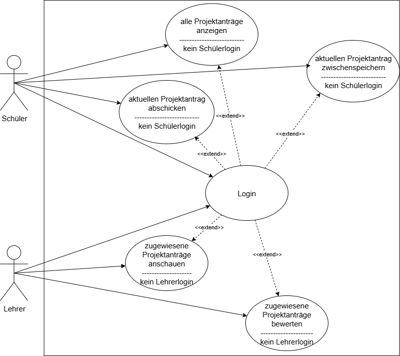
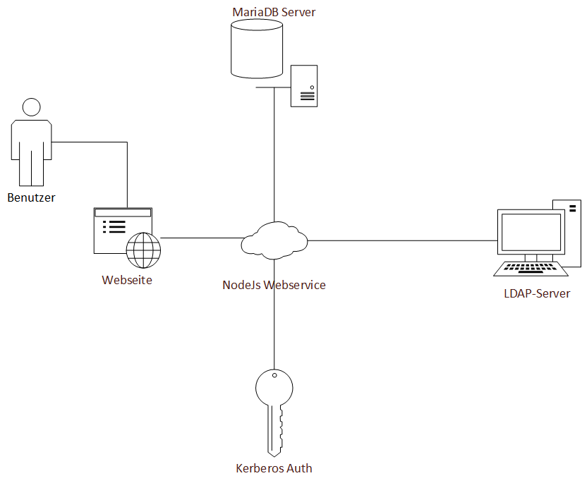

= Projektdokumentation IHK-Projektanträge
:doctype: book
:author: Sophie Fronauer, Michael Mielenz, Mark Rotaru
:source-highlighter: highlight.js
:highlightjs-languages: javascript
:lang: de
:data-uri:      // Bilder in der HTML-Datei
:toc: left
:toclevels: 3
:toc-title: Inhaltsverzeichnis
:sectnums:
:sectnumlevels: 10
:figure-caption!:

== Einleitung/Gemeinsamer Teil

=== Projektbeteiligte

|===
|Projektbetreuer        | Herr Heitzer 
|Projektteil Frontend   | Sophie Fronauer, Mark Rotaru  
|Projektteil Backend    | Michael Mielenz         
|===

=== Ist-Analyse

Bisher müssen die Projektanträge in der 12. Klasse in einem Word-Dokument verfasst und an den Lehrer per E-Mail gesendet werden. Dieser muss dann die Dokumente herunterladen und entweder in Word oder in einem seperaten Text bewerten. Anschließend wird eine Mail an den Schüler zurückgeschickt, in der steht, ob der Antrag angenommen oder abgelehnt wurde, zusammen mit der Begründung.

=== Motivation

Der bisherige Ablauf sorgt für unnötigen Aufwand und ist für beide Parteien unpraktisch. Lehrer bekommen viele Projektanträge per Mail und es kann so leichter passieren, dass ein Antrag übersehen wird. Ziel des Projekts ist es daher, eine webbasierte Anwendung zu entwickeln, die das Stellen, Bearbeiten und Verwalten der Anträge vereinfacht und so den Prozess effizienter gestaltet.

=== Use Case Diagramm

[width=600, title='Übersicht über die Funktionen']

=== Technologien

Die Bereitstellung erfolgt über Docker-Container. Das Backend basiert auf einem Node.js-Server, der als Webservice dient. Für die Definition der API-Endpoints wird Express.js benutzt, während Sequelize als ORM zur Datenbankinteraktion mit einer MariaDb verwendet wird. Es werden in der Web-API noch viele weitere Funktionen benötigt, die mit NPM-Packages zur Verfügung gestellt werden. Beispiele hierfür wären `krb5` und `ldapts`, die zur Authentifizierung mit Kerberos und einem LDAP-Server benutzt werden oder `jsonwebtoken` und `express-jwt` zum Erstellen und Überprüfen der <<token, Tokens>>. Diese Funktionalitäten selbst zu schreiben würde viel Aufwand erfordern. Zudem erhalten die bestehenden Pakete weiterhin Support und werden kontinuierlich weiterentwickelt, wodurch sie eine höhere Sicherheit bieten, da viele Personen daran arbeiten.

Das Frontend wurde mit Next.js und React entwickelt, wobei Material-UI als CSS-Framework zum Einsatz kommt. Next.js wird verwendet, da es ein einfaches, dateibasiertes Routing bietet. Material-UI überzeugt durch eine umfangreiche Sammlung an Komponenten und legt den Fokus auf modernes Design, genau das, was in dieser Anwendung erreicht werden soll. Zudem verfügen React, Next.js und Material-UI über sehr große Communities, wodurch eine kontinuierliche Weiterentwicklung und Unterstützung gewährleistet ist.

Als Programmiersprache wird JavaScript verwendet, da dies nur für React möglich ist und das Backend ebefalls mit Node.js auch nur mit JavaScript oder Typescript läuft.

=== Allgemeine Umsetzung

[width=600, title='Übersichtsdiagramm über den Datenfluss']

Die Applikation wird als plattformunabhängige Webanwendung umgesetzt, die über den Browser zugänglich ist. Dadurch wird eine einfache und schnelle Nutzung auf unterschiedlichen Geräten ermöglicht. Die Web-Anwendung leitet alle Daten über den Webservice, der diese dann verarbeitet. Die API ist anschließend mit allen weiteren Komponenten im Backend verbunden.

=== Installation und Deployment

Für den Endnutzer ist keine Installation erforderlich, da die Anwendung über den Webbrowser zugänglich ist.
Das Deployment erfolgt durch die Entwickler oder Administratoren mittels folgender Schritte:

Repository klonen: `git clone https://gl.edvschule-plattling.de/trfi_heitzer/bfs2023fi/he2.git`

Anschließend müssen noch die Umgebungsvariablen gepflegt werden. In den Ordner `IHK_Projektantraege-Frontend/` kommt eine neue `.env`-File mit folgendem Inhalt:

[source,plaintext]
----
URL=10.20.30.40:3001    // Ip des Hostrechners 
----

In `IHK_Projektantraege-Webservice/` ebenfalls eine `.env`-File, hier wird folgender Inhalt benötigt:

[source,plaintext]
---- 
TOKEN_KEY=PasswortFürJWTSignierung
MARIADB_HOST=10.20.30.40                // IP der DB
MARIADB_USERNAME=foo
MARIADB_PASSWORD=bar
MAIL_HOST=mx.foobar.de                  // Name des Mail-Servers
MAIL_USERNAME=foo
MAIL_PASSWORD=bar
MAIL_ADRESS=foo@edvschule-plattling.de
MAIL_ALIAS=IHK_Projektantraege
LDAP_URI=ldap://foobar.de               // URL des LDAP-Servers
LDAP_BASE_DN=OU=Benutzer,DC=dvs-plattling,DC=de
LDAP_PASSWORD=foobar                    // Bind-Passwort für den LDAP
URL_FRONTEND=http://10.0.146.109:3000   // URL über die die Website aufgerufen wird
----

Da die Anwendung durch Docker verwaltet wird, sind für die Teilprojekte Dockerfiles definiert. Die Images der Dockerfiles von sowohl dem Frontend als auch vom Backend basieren auf dem `node:23`-Image. Diese kopieren das aktuelle Working-Directory und öffnen den Port 3000 (Frontend) bzw. 3001 (Backend). Zusätzlich werden die Dockerfiles von einer `docker-compose.yaml` gesteuert. In dieser werden zusätzlich auch noch `Volumes` erstellt, die zum Entwickeln den Source-Code auf die Container übertragen.

Die gesamte Applikation mit den Containern wird mit einem `docker compose up` serverseitig gestartet und steht anschließend im Netzwerk zur Verfügung.

<<<<

== Softwarefunktion

include::doku_anmeldung.adoc[leveloffset=+1]

<<<<

include::doku_antragStellen.adoc[leveloffset=+1]

<<<<

include::doku_antragBewerten.adoc[leveloffset=+1]

<<<<
    
== Anhang

=== Glossar
|===
| Begriff                           | Beschreibung                                                                      | Quellen, bzw. weitere Informationen
| Geplanter Bearbeitungszeitraum    | Beinhaltet des kompletten Zeitraum des Projekts, also von Start bis Abgabe        | ---
| Kerberos                          | Ein Protokoll zum Authentifizieren                                                | https://web.mit.edu/kerberos/
| LDAP                              | Ein Protokoll zur Kommunikation mit Verzeichnisdiensten wie Active Directory      | https://www.redhat.com/de/topics/security/what-is-ldap-authentication
| OU                                | Organisationseinheit in einem Active Directory, in der z.B. Benutzer sind         | https://www.computerweekly.com/de/definition/Active-Directory-Organisationseinheit-AD-OU
| DN                                | Steht für Distinguished Names und ist zum Referenzieren von Objekten im AD        | https://learn.microsoft.com/en-us/previous-versions/windows/desktop/ldap/distinguished-names
| JWT                               | JSON Web Token: Spezieller Token mit Signatur um die ID zu beweisen               | https://jwt.io/introduction
| npm                               | Paket-Manager für JavaScript-Libaries                                             | https://www.npmjs.com/about
| ORM                               | Object Relation Mapper => Datenbankzugriffe über Code; SQL nur im Hintergrund     | https://de.wikipedia.org/wiki/Objektrelationale_Abbildung
| Base64                            | Codierung für Dateien                                                             | https://de.wikipedia.org/wiki/Base64
| JSX                               | Auszeichnungssprache für Komponenten in React                                     | https://react.dev/learn/writing-markup-with-jsx
| React                             | Library für webbasierte Oberflächen                                               | https://react.dev/
| Next.js                           | Web-Framework für React                                                           | https://nextjs.org/
| Render                            | UI in React wird auf den aktuellen Zustand gebracht und angezeigt                 | https://react.dev/learn/render-and-commit
| map                               | JavaScript-Funktion, die jedes Element in einem Array transformiert               | https://developer.mozilla.org/en-US/docs/Web/JavaScript/Reference/Global_Objects/Map  
|===