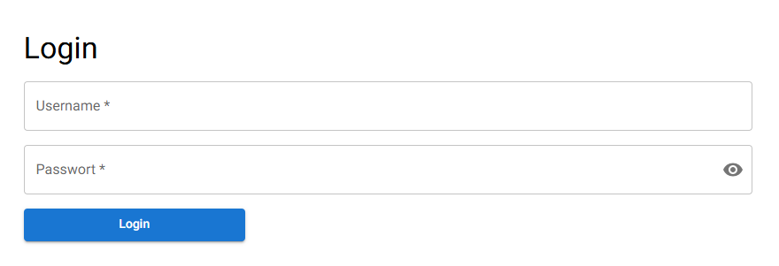

:numbered:

== Anmeldung eines Schülers

Der Schüler Hans besucht derzeit die 12. Klasse und soll im Rahmen des Unterrichts einen Projektantrag stellen. Dafür muss er auf die Website zugreifen.

=== Strukturkonzept im Frontend

[source,plaintext]
----
IHK_Projektantraege-Frontend/
└── app/
    ├── components/
    │   └── ...
    ├── error/
    │   └── page.js
    ├── login/
    │   └── page.js
    ├── ...
    ├── utils/
    │   └── ...
    ├── ui/
    │   └── ...
    ├── model/
    │   └── ...
    └── page.js
----

- `app/` ist der Hauptordner, durch den der App-Router verwendet wird. Dieser ersetzt den veralteten pages-basierten Router, der standardmäßig clientseitig arbeitet, weswegen dieser weniger effizient ist. Der App-Router ermöglicht die Definition von Routen, die über die URL aufgerufen werden können. Für jede neue Route wird ein Ordner mit dem gewünschten URL-Namen angelegt, der eine page.js-Datei als Einstiegspunkt enthält.

- `components/` enthält Komponenten, die an verschiedenen Stellen der Anwendung wiederverwendet werden. Dadurch wird duplizierter Code vermieden und die Wartbarkeit verbessert.

- `utils/` beinhaltet Hilfs- und allgemeine Funktionen wie beispielsweise Context-Definitionen, die an verschiedenen Stellen im Projekt genutzt werden können. Eine Hilfsfunktion wäre zum Beispiel AuthTokenHelper, der zum Prüfen vorhandener Tokens verwendet wird.

- `ui/` enthält Komponenten, die direkt auf den Seiten angezeigt werden und speziell für die Darstellung innerhalb der jeweiligen Page gedacht sind. Im Gegensatz zu den Komponenten im Ordner `components` werden diese ui-Komponenten nicht wiederverwendet, wie zum Beispiel die Antragsseite.

- `models/` beinhaltet definierte Klassen und stellt die Datenstrukturen dar, die im Frontend verwendet werden, z.B. die Klasse `User`.

=== React-Funktionalitäten

==== Funktionskomponenten

Funktionskomponenten sind die UI-Bausteine in React. Dabei handelt es sich um JavaScript-Funktionen, die `JSX` zurückgeben (ähnlich der HTML-Syntax). Diese beschreiben, was auf der Webseite dargestellt werden soll. Funktionskomponenten dienen dazu, die Benutzeroberfläche in kleine Teile zu gliedern, anstatt eine einzelne umfangreiche Seite zu erstellen.

Eine sogenannte Funktionskomponente wird beispielsweise in <<abmelden, Abmelden>> verwendet.

==== Server- und Client-Komponenten
Funktionskomponenten können an unterschiedlichen Orten gerendert werden. Server-Komponenten werden auf dem Server gerendert, Client-Komponenten hingegen im Browser. Standardmäßig sind Komponenten serverseitig ausgelegt, da dies effizienter ist: Der Server kann die komplette HTML an einem zentralen Ort rendern und so schneller ausliefern.
Um eine Client-Komponente zu erstellen, muss in der ersten Zeile der Komponente `"use client"` eingefügt werden. Client-Komponenten sind notwendig, wenn interaktive Funktionen benötigt werden.

Deshalb kommt im LoginContainer eine clientseitige Komponente zum Einsatz, um die Benutzereingaben zu ermöglichen. Die Seite mit der Meldung `Gespeichert` ist hingegen eine serverseitige Komponente, da dort keine Benutzereingaben erforderlich sind.

==== Hooks
Ein wichtiger Bestandteil im Frontend sind die sogenannten Hooks, die es ermöglichen, React-Features ohne das Anlegen von Klassen zu nutzen. Hooks funktionieren ausschließlich in Funktionskomponenten und erleichtern es, die Darstellung von UI-Komponenten von der Business-Logik zu trennen.

Dabei ist zu beachten, dass Hooks nur in clientseitigen Komponenten verwendet werden können. Außerdem muss sichergestellt werden, dass beim Rendern immer dieselbe Reihenfolge der Hook-Aufrufe eingehalten wird, da es sonst zu Fehlern kommt.

Die drei grundlegenden Hooks im Projekt sind folgende:

- `useState` dient dazu, lokale Werte einer Komponente zu verwalten und Änderungen daran vorzunehmen. Sobald sich der `State` ändert, wird die UI automatisch neu gerendert.

- `useEffect` wird für `Side-Effects` verwendet, beispielsweise für das Laden von Daten über eine API, wie das Abrufen von Projektanträgen. Ein `useEffect` wird nach dem Rendern einer Komponente ausgeführt. Mithilfe eines sogenannten Dependency-Arrays, das in eckigen Klammern angegeben wird, lässt sich festlegen, wann der Effekt erneut ausgelöst wird.

[source,javascript]
----
 useEffect(() => {
        const checkAuth = async () => {
            ...
        };
        checkAuth();
    }, [router, setLogin]);
----

In diesem Beispiel sind `router` und `setLogin` als Dependencies definiert. Das bedeutet: Der Effekt wird nach dem ersten Render ausgeführt und immer dann, wenn sich eine dieser Abhängigkeiten ändert. Wird kein Dependency-Array angegeben, läuft der Effekt nach jedem Render. Ein leeres Array sorgt dafür, dass der Effekt nur einmal, direkt nach dem ersten Render, ausgeführt wird.

- `useContext` ermöglicht das Teilen von globalen Daten über alle Komponenten hinweg. Der `Context Provider` stellt den Wert für alle darin eingeschlossenen Komponenten bereit. Wenn sich der Wert ändert, werden alle Komponenten, die diesen Context nutzen, neu gerendert.

[source,jsx]
----
<LoginProvider>
      <CombinedAntragProvider>
        <AppRouterCacheProvider>
            <ThemeProvider theme={theme}>{children}</ThemeProvider>
        </AppRouterCacheProvider>
      </CombinedAntragProvider>
</LoginProvider> 
----

Im obigen Code wird im `layout.js` auf oberster Ebene der `LoginProvider` gesetzt, der alle darunterliegenden Komponenten einschließt und somit den Zugriff auf die gemeinsamen Daten ermöglicht.

[[login]]
=== Login-Form im Frontend

[width=600, title='Maske für Anmeldung']

Beim Aufruf der Seite wird zunächst überprüft, ob Hans bereits ein gültiges <<token,Token>> besitzt. Diese Prüfung erfolgt unmittelbar nach dem ersten Render der Seite durch einen `useEffect`. Innerhalb dieses Effekts wird die Funktion `checkToken` aufgerufen.

[source,javascript]
----
const checkToken = async () => {
      const result = await AuthTokenHelper();
      if (result) {
        setLogin(result);
        const url =
          result.role === "pupil"
            ? "/menuProposal"
            : result.role === "teacher"
              ? "/teacher"
              : "/login";
        router.push(url);
      } else {
        setLoading(false);
      }
    };
----

Die Funktion `checkToken` ruft `AuthTokenHelper` auf, um zu prüfen, ob ein gültiger Token vorhanden ist.
Wenn ein gültiges Ergebnis zurückgegeben wird, wird der Benutzer abhängig von seiner Rolle zur entsprechenden Seite weitergeleitet.
Im Fall von Hans erfolgt die Weiterleitung auf `/menuProposal`.
Falls es keinen gültigen Token gibt, wird lediglich der Ladezustand aktualisiert und die Login-Maske bleibt weiterhin sichtbar.

[source,javascript]
----
const AuthTokenHelper = async () => {
  const token = getCookie('token');
  if (!token) return null;

  const rep = await RequestHandler.getData(endpoints.VerifyUserToken, '');
  if (rep.data.success) {
    return {
      username: rep.data.data.ldapUsername,
      authenticated: rep.data.data.authenticated,
      role: rep.data.data.role,
      session: token,
    };
  }
  return null;
};

export default AuthTokenHelper;
----

Die Hilfsfunktion `AuthTokenHelper` übernimmt die eigentliche Prüfung des <<token, Tokens>>. Es wird versucht, den Token aus dem Browser auszulesen. Ist keiner vorhanden, wird `null` zurückgegeben. Falls einer existiert, wird ein API-Endpunkt aufgerufen, der überprüft, ob der Token noch gültig ist. Falls dies der Fall ist, werden die entsprechenden Benutzerdaten vom Backend zurückgegeben und im Context gespeichert. Ist der Token ungültig, wird `null` zurückgegeben.

Vor dem Absenden wird überprüft, ob die Eingabefelder ausgefüllt sind und ob die Anmeldedaten korrekt sind. Bei leeren Feldern oder ungültigen Zugangsdaten erscheinen entsprechende Fehlermeldungen (Alerts), die den Nutzer auf das jeweilige Problem hinweisen.
Sobald die Daten korrekt sind, erfolgt die Weiterleitung zur Seite `/menuProposal` über `router.push`.

[[token]]
=== Token

Zur Authentifizeriung werden JWT als Bearer Token verwedent, die für den Nutzer als Cookies im Browser gespeichert werden. Die Tokens haben folgende Beispiel-Payloads, wenn sie entschlüsselt werden:
[source,json]
----
{
  "ldapUsername": "hans",
  "role": "pupil",
  "mailAdress": "Hans.Hansibald@edvschule-plattling.de",
  "iat": 1751458368,
  "exp": 1752063168
}
----
Der Token enthält alle Daten, die für das Bearbeiten von Anträgen im Frontend nötig sind.

=== Authentifizierung durch das Backend

Bei der Authentifzierung von Hans wird die Web-API aufgerufen, um seinen <<token, JWT>> zu bekommen.

=== API-Aufbau

Die API hat folgenden Aufbau:
[source,plaintext]
----
IHK_Projektantreage-Webservice/
└── src/
    ├── databaseScripts/
    ├── middleware/
    ├── models/
    ├── routes/
    └── utils/
----

Die Hauptmodule sind alle unter `src/`. Alle weiteren wurden in die folgenden Unterordner einsortiert:

- `databaseScripts/`: Enthält Skripte um die Datenbank zu manipulieren oder um z.B. Test-Datensätze einzufügen 
- `middleware/`: Beinhaltet alle Elemente, die bei entsprechenden Anfragen von Endpoints vor dem Code ausgeführt werden
- `models/`: Alle Sequelize-Definitionen und sonstige Klassen
- `routes/`: Herzstück der Anwendung, mit den Skripten für die Endpoint-Definitonen
- `utils/`: Auslagerungen von Funktionalitäten

Die Aufrufe der API werden durch Express.js ermöglicht. Alle Endpoints sind nach `GET`, `POST` und `PUT` in eigene JavaScript-Files aufgeteilt. Der Grund dafür ist, dass es nicht viele Endpoints gibt und diese thematisch sehr stark zusammengehören, deswegen wurden sie in ihre HTTP-Methoden gegliedert.

=== Authentifzierung

[source, javascript]
----
try {
  await krb5.kinit({
    principal: ldapName,
    password: passwd,
  });
} catch (error) {
  // Ungültige Anmeldedaten
}
----
Der User wird gegenüber dem Kerberos-Server der Schule authentifziert.

[source, javascript]
----
const entry = await getLdapUserEntry(ldapName);
if (entry === null) {
  // Fehler; kein User wurde gefunden
}
const role = entry.dn.includes('Lehrer') ? 'teacher' : 'pupil';
----
Sollten die Anmeldedaten von Hans übereinstimmen, wird anschließend der LDAP nach dem User abgefragt. Sollte ein Fehler entstehen, wird eine Custom-Fehlermeldung geworfen, ansonsten wird anhand des `DN` überprüft, in welcher `OU` Hans ist und welcher Gruppe er angehört.

[source, javascript]
----
const token = jwt.sign(data, key, { expiresIn: '7d' });

res.cookie('token', token, {
  httpOnly: false,
  sameSite: 'Lax',
  maxAge: 1000 * 60 * 60 * 24 * 7, // 7 Days in ms
});
----
Anhand von diesen Informationen wird ein <<token,JWT>> erstellt und signiert, der eine Lebenszeit von 7 Tagen hat. Der Token wird dann per `Cookie`, der ebenfalls 7 Tage gültig ist, zurück an das Frontend geschickt.