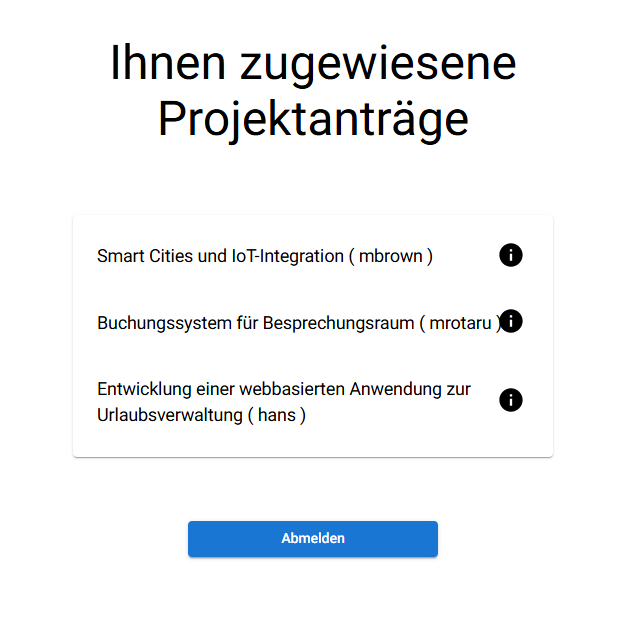
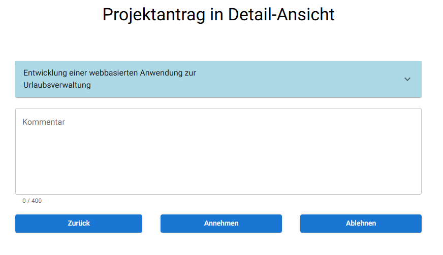

:numbered:

== Bewertung der Anträge

Herr Alphons, der zuständige Lehrer für den Antrag von Hans, hat diesen erhalten und möchte ihn nun aufgrund der zuvor erhaltenen E-Mail überprüfen und entweder annehmen oder ablehnen.

=== Anmeldung eines Lehrers

Die Anmeldung erfolgt wie oben beim Login beschrieben, allerdings erhalten Lehrer dabei die Rolle `teacher` statt `pupil` und werden anschließend auf die Lehrerseite weitergeleitet.

=== Maske mit allen zu bearbeitenden Anträgen

Herr Alphons erhält eine Übersicht über sämtliche Anträge, die ihm von Schülern zur Überprüfung zugewiesen wurden.

[width=600, title='Zugewiesene Projektanträge ansehen']

Die Anträge werden in einem TableContainer innerhalb eines Accordions dargestellt. Unter den angezeigten Anträgen befindet sich auch der Projektantrag von Hans.

Ein Endpoint liefert alle Projektanträge, die aktuell zur Überprüfung offenstehen und explizit diesem Lehrer zugewiesen wurden. Dadurch wird sichergestellt, dass Herr Alphons nur die für ihn relevanten Anträge zu sehen bekommt.

==== Antrag bearbeiten

[width=600, title='Antrag ablehnen oder annehmen']

Wenn Herr Alphons auf den Antrag klickt, sieht er diesen mit allen Details und Informationen und kann ihn genau prüfen. Dabei wird mithilfe von `useSearchParams`, einem Hook, der das Auslesen bestimmter Query-Parameter aus der URL ermöglicht, die ID aus dem Feld `proposalid` ermittelt und der entsprechende Antrag für diese ID abgerufen.

Anschließend kann der Antrag entweder angenommen oder abgelehnt werden. Dabei hat der Lehrer die Möglichkeit, einen Kommentar hinzuzufügen: Beim Ablehnen ist ein Kommentar verpflichtend, beim Annehmen optional. Der Kommentar wird anschließend zusammen mit dem Status, ob der Antrag angenommen oder abgelehnt wurde, zum Webserver gesendet.

Darüber hinaus wird sichergestellt, dass bei einer Änderung der Query-Parameter in der URL alle relevanten Fälle berücksichtigt werden: Es wird geprüft, ob der Antrag bereits überprüft wurde, ob ein Antrag für die angegebene ID existiert, ob sich der Antrag noch in Bearbeitung befindet oder ob er einem anderen Lehrer zugewiesen ist.

Leider entspricht der Antrag von Hans nicht den Erwartungen von Herrn Alphons und wird deshalb abgelehnt.

=== Mail an Schüler

Wenn Herr Alphons den Antrag bewertet, wird in der API ein weiterer `PUT` ausgeführt. Dieser speichert in der Datenbank den Kommentar ab. Ebenfalls wie bei der <<mailAnLehrer, E-Mail an den Lehrer>> wird über LDAP, die Mailadresse herausgefunden.

Der Schüler wird dann zur Kenntnis gesetzt, ob sein Antrag angenommen oder abgelehnt wurde und bekommt auch die Möglichkeit, über die URL direkt die Website zu besuchen.

== Wie geht es weiter mit Hans?

Der Antrag von Hans wurde abgelehnt. Er muss nun einen neuen Antrag stellen. Dieser Prozess wiederholt sich so lange, bis ein Antrag eingereicht wird, der den Anforderungen entspricht und genehmigt wird.