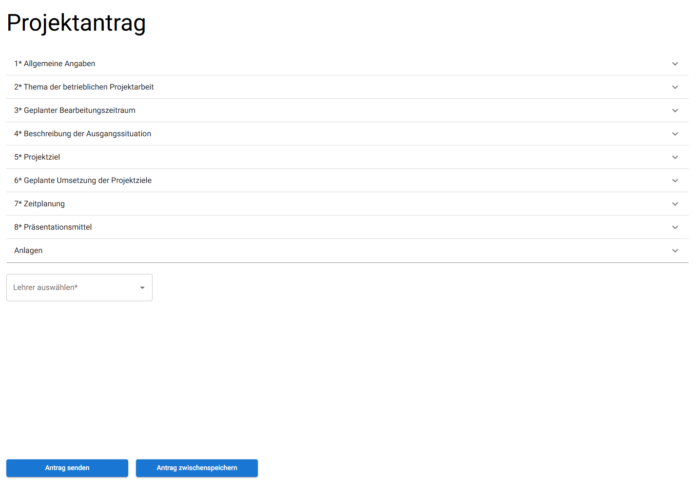
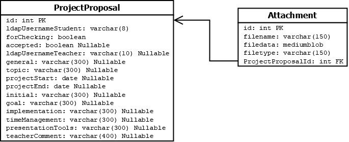
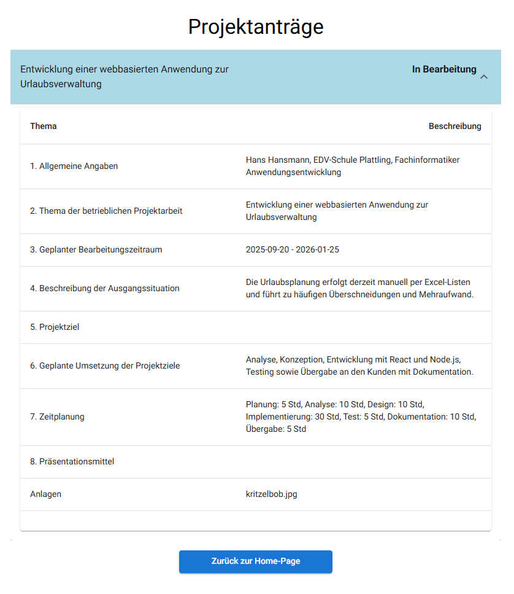
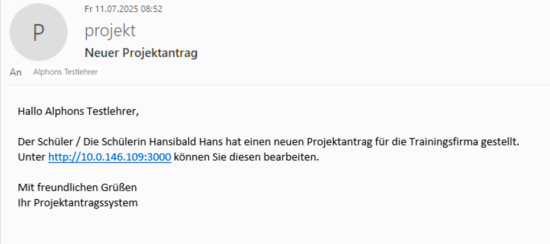

:numbered:

== Antrag stellen

Nach dem Login hat Hans nun die Möglichkeit, einen neuen Antrag anzulegen oder sich abzumelden.

=== Zugriffskontrolle beim Seitenaufruf

Bei einem Seitenaufruf wird auf Token und Rolle geprüft (Vergleich oben <<login, Login>>). Sollte der Zugriff ungültig sein wird auf eine Fehlerseite weitergeleitet.

[[antragsmaske]]
=== Antragsmaske im Frontend

[width=600, title='Maske für Antrag stellen']

Die Antragsmaske enthält alle Felder, die auch von der IHK bereitgestellt werden, um eine realitätsnahe Abbildung zu gewähren. Dieser Projektantrag orientiert sich am IHK-Szenario, bei dem ein Antrag so lange erneut eingereicht werden kann, bis er schließlich angenommen wird, wenn er zuvor abgelehnt wurde. Zusätzlich gibt es eine Dropdown-Auswahl (Combobox), mit der der zuständige Lehrer ausgewählt werden kann. Die Daten hierfür werden per GET-Request in einem `useEffect` direkt nach dem ersten Rendern der Komponente abgerufen.

Weiterhin ist ein geplanter Bearbeitungszeitraum anzugeben, der über Datepicker-Komponenten ausgewählt wird, im Gegensatz zur IHK, die dies nur als weiteres Textfeld darstellt. Für die Datumsfelder ist eine einfache Prüfung definiert, um sicherzustellen, dass das Projektende nicht vor dem Projektstart liegt.

Es besteht außerdem die Möglichkeit, Anlagen hinzuzufügen. Beim Klick auf den entsprechenden Button öffnet sich der Datei-Explorer zur Auswahl der Dateien. Die Gesamtgröße aller hochgeladenen Dateien ist auf 100 MB begrenzt, da der JSON-Body der API-Requests auf 120 MB limitiert ist. Beim Hochladen werden die Dateien mittels `map` in <<dateien, Base64>>-codierte Strings konvertiert.

Alle anderen Eingabefelder sind einfache Textfelder und, mit Ausnahme der Anlagen, als Pflichtfelder definiert. Die Validierung erfolgt durch eine Schleife, die überprüft, ob diese ausgefüllt sind.

[[antrag_zwischenspeichern]]
=== Zwischenspeichern vom Antrag
Neben dem Abschicken des Antrags hat Hans die Möglichkeit, seinen Antrag zwischenzuspeichern.

Dabei wird zunächst ein Objekt aus den verschiedenen Eingabefeldern erstellt, das als Ganzes an das Backend übertragen wird. Anschließend wird geprüft, ob bereits ein bestehender Antrag in der Datenbank vorhanden ist. Falls ja, werden die vorhandenen Daten mit den neuen Werten aktualisiert. Handelt es sich hingegen um einen neu angelegten Antrag, wird dieser von der API angelegt. Da es sich nur um das Zwischenspeichern handelt, müssen noch nicht alle Felder ausgefüllt sein.

Nach dem erfolgreichen Speichern wird Hans auf eine minimal gehaltene Bestätigungsseite weitergeleitet, die ihn darüber informiert, dass der Antrag erfolgreich gespeichert wurde. Von dort aus hat er die Möglichkeit, entweder ins Menü zurückzukehren oder sich den gespeicherten Antrag anzeigen zu lassen.

[[abmelden]]
=== Abmelden

Da Hans für heute genug gearbeitet hat, möchte er sich nun abmelden.

[source,javascript]
----
'use client';
const MenuButtons = () => {
  const { login, setLogin } = useContext(LoginContext);
  const router = useRouter();

  const handleLogout = () => {
    deleteCookie('token');
    setLogin(() => ({
      username: "",
      authenticated: false,
      role: "",
      session: "",
    }));

    router.push('/login');
  };

  return (
    <>
        <MenuComponentButton onClick={() => handleLogout()} text="Abmelden" />
    </>
  );
};

export default TeacherContainer;

----

In diesem Codeausschnitt wird der Logout-Button in `MenuButtons` dargestellt. Im Return-Block wird eine Button-Komponente zurückgegeben, die zum Abmelden dient. Beim Klick auf den Button wird die Funktion `handleLogout` ausgeführt. Diese löscht den vorhandenen Token im Browser und setzt den LoginContext auf die Standardwerte zurück. Anschließend wird der Nutzer zur Login-Seite weitergeleitet.

[[dateien]]
=== Dateien und Base64

Die Dateien, die als Anhänge beim Antrag dabei sind, werden in `filename`, `filedata` und `filetype` aufgeteilt. Die Filedata werden in `Base64` codiert und mit den restlichen Daten im JSON-Format mit zum Webservice geschickt.

=== Datenbankaufbau

[title='UML-Diagramm der Datenbank']

Hauptbestandteil ist die `ProjectProposal`-Tabelle, die alle Daten über den Antrag und auch seinen Status hält. Die Datenfelder, die der Enduser in der <<antragsmaske,Antragsmaske>> eingibt, sind alle `Nullable`, da es die Möglichkeit zum <<antrag_zwischenspeichern, Zwischenspeichern>> gibt und deswegen die Felder auch vorerst leergelassen werden können. Ein Schüler kann nur einen aktuellen Antrag, an dem er noch arbeitet oder auf eine Bewertung wartet, in der Datenbank haben. Im Webservice wird dies sichergestellt, indem der Schüler erst einen neuen Antrag stellen kann, wenn der aktuelle abgelehnt wurde. 

In einer 1:n-Beziehung dazu steht die `Attachment`-Tabelle, in der die ganzen Anhänge für den Projektantrag gespeichert werden. Die <<dateien, Dateien>> werden in die drei entsprechenden Spalten aufgeteilt. Der Base64-String wird als `mediumblob` abgespeichert. 

=== Backend: addNewProjectProposal

Wenn jetzt also Hans die ersten Felder ausgefüllt hat und diese im Backend ankommen, wird durch den `POST` ein neuer Antrag in der DB angelegt. Anhand von diesem Beispiel wird nun der Aufbau durch Express.js, die Authentifzierung beim Aufruf der API mit den JWT und der Datenbankzugriff mit Sequelize erklärt. 

==== Authentifizierung mit JWT

Damit die Routen der API durch <<token, Bearer Token>> geschützt werden, muss in der `app.js` die nötige Middleware eingebunden werden. Das sieht so aus:

[source, javascript]
----
app.use(checkJwt);
app.use(errorHandling);
----

`checkJWT` prüft bei jedem API-Aufruf, bis auf `/authentication`, ob ein JWT vorhanden ist und ob die Signatur mit dem Token-Passwort übereinstimmt. Wenn nicht wirft dies einen Fehler. Dieser muss dann passend abgefangen werden. Dafür wird `errorHandling` mit eingebunden, damit Exceptions, die von anderer Middleware geworfen werden, trotzdem beachtet werden können. Somit wird verhindert, dass der Webservice abstürzt.

==== Definieren eines Endpoints

[source, javascript]
----
const postRoute = express.Router();

postRoute.post('/addNewProjectProposal', upload.array('attachments'), async (req, res) => {
  try {

    // An dieser Stelle die Überprüfung und Verarbeitung der Daten
 
    return res.status(200).send(new ResponseModel(true, 'Data successfuly added!', {}));
  } catch (error) {
    return res.status(500).send(new ErrorResponseModel(error));
  }
});
----

Als Erstes wird für jede Routes-File ein `Router`-Objekt durch das Express-Modul erstellt. Diesem Objekt werden beliebig viele Endpoints hinzugefügt. In diesem Beispiel wird ein `POST` angelegt mit der Endung `/addNewProjectProposal`. Sollte der Endpoint spezielle zusätzliche Middleware benötigen, kann man nach der Namensdefinition diese einfach als weitere Parameter übergeben. Hier wird mit `upload.array()` ermöglicht, dass beliebig viele Dateien mit im Reqest-Body mitgeschickt werden können. Der letzte Parameter der post-Methode muss aber ein Handler sein, der zwei Parameter enthält und auch die 'wirkliche' Logik der Route definiert. 

Die Namen `req` und `res` sind frei wählbar, sollten aber so benannt werden, da dies der Standard ist. 
|===
| req | Request | Enthält die Daten aus dem Request: Queryparamter, Body, Bearer-Token ...
| res | Response| Enthält die Daten, die man zurückschickt: Statuscode, Body ...
|===

Trotz der globalen Fehlerbehandlung wird der Code in einem Try-Catch umschlossen, da man spezifischere Fehlermeldungen schreiben kann und auch zum Testen hilfreich ist. Im Return wird der Status HTTP-Statuscode festgelegt, hier in dem Beispiel 200 oder 500. Außerdem werden zusätzlich die Rückgabedaten der Response gesetzt, in diesem Fall eine eigene Klasse.

[[datenbankzugriff]]
==== Datenbankzugriff

Der Datenbankzugriff wird über Sequelize, einem modernen ORM für JavaScript und TypeScript, ermöglicht. Die Entscheidung für einen ORM kam daher, weil es einfacher ist als SQL-Statements zu schreiben und man durch die Sequelize-Definitionen fertige Klassen bekommt.

[source, javascript]
----
const db = {};
db.Sequelize = Sequelize;
db.sequelize = sequelize;

// Tables
db.projectProposal = ProjectProposal(sequelize, Sequelize);
db.attachment = Attachment(sequelize, Sequelize);
// Relations
db.projectProposal.hasMany(db.attachment);
db.attachment.belongsTo(db.projectProposal);
----
In der `db.js` wird ein Objekt erstellt, was alle Funktionaitäten von Sequelize bekommt. Zusätzlich werden dort die Table-Definitonen und die jeweiligen Beziehungen gesetzt.

[source, javascript]
----
const ProjectProposal = db.projectProposal;
const Attachment = db.attachment;
----
In den Modulen, die auf die Datenbank zugreifen, wird, als Best-Practice, für die benötigten Tabellen eine Variable erstellt. Das ist zwar nicht unbedingt nötig, aber sorgt dafür, als würde man dann wirklich auf richtige Klassen zugreifen.

[source, javascript]
----
const result = await db.sequelize.transaction(async (t) => {
   const newProjectProposal = await ProjectProposal.create(
     {
         // setzen der Felder
     },
     { transaction: t }
   );
   const files = [];
   for (let i = 0; i < data.attachments.length; i++) {
     files.push(
       await Attachment.create(
         {
           // setzen der Felder
         },
         { transaction: t }
       )
     );
   }
   await newProjectProposal.addAttachments(files, { transaction: t });
 });
----

Dieser Auszug kommt auch aus `/addNewProjectProposal`. Da Datensätze eingefügt werden, ist es wichtig, diese in einer expliziten Transaktion zu kapseln. Das läuft automatisch über die `transaction`-Funktion. Innerhalb dieser wird dann in allen Datenbankzugriffen der Verweis auf die Transaktion mitgegeben. Als erstes wird mit `create` ein neuer Datensatz erstellt und gleich in die Konstante `newProjectProposal` zurückgeschrieben. Anschließend wird für jede übergebene File ein neuer Datensatz erstellt. Gleichzeitig werden die Objekte auch wieder in das Array `files` gespeichert. Als letztes wird der Foreign-Key gesetzt. Das geschieht über `addAttachments`, eine automatisch generierte Funktion von Sequelize. Diese Funktion ermöglicht es, dass der Besitz bzw. der Parent gesetzt wird.

=== Anträge wieder ansehen

[title='Maske Antrag ansehen']

Alle Anträge mit dem Status `In Bearbeitung`, `In Überprüfung`, `Angenommen` oder `Abgelehnt` können erneut eingesehen werden. Da Hans lediglich einen Antrag zwischengespeichert hat, wird ihm dieser als bearbeiteter Antrag in einem eigenen Accordion-Element angezeigt.

Dazu werden zunächst alle Anträge des jeweiligen Users abgerufen und in einen Context geladen. Anschließend werden aus diesen Daten entsprechende Objekte erstellt, die in einer Accordion-Komponente dargestellt und zurückgegeben werden. Abhängig vom Status des jeweiligen Antrags wird einer der oben genannten Zustände zur besseren Orientierung gesetzt.

=== Fertigstellen vom Antrag

Hans hat seinen Antrag vollständig ausgefüllt und sendet ihn nun ab, damit ein Lehrer diesen überprüfen kann.

Beim Klick auf den Button `Abschicken` wird der aktuelle Antrag erneut abgerufen und, wie bereits zu Beginn erwähnt, auf Vollständigkeit geprüft. Anschließend werden die Daten in der Datenbank aktualisiert und der Antrag wird zur Überprüfung freigegeben. Ab diesem Zeitpunkt kann der Antrag nicht mehr bearbeitet werden und es ist auch nicht möglich, einen neuen Antrag zu erstellen, es sei denn, der eingereichte Antrag wird abgelehnt.

Nach dem erfolgreichen Absenden wird der Nutzer auf eine minimal gehaltene Bestätigungsseite weitergeleitet, die darüber informiert, dass der Antrag erfolgreich abgeschickt wurde.

=== Backend: Antrag updaten und abschicken

==== Updaten
Beim Aktualisieren der Felder des Antrags wird eine `PUT`-Methode verwendet. Diese ist vom Aufbau sehr ähnlich zum Erstellen der Anträge, wie im <<datenbankzugriff, Datebankzugriff>> beschriebenen worden ist.

[source, javascript]
----
await ProjectProposal.update(
        {
          // setzen der Felder
        },
        {
          where: {
            id: id,
          },
          transaction: t,
        }
      );
----
Hierbei ist der einzige Unterschied, dass ein ein `update` verwendet wird und im `where` auf die `id` geprüft wird.

[source, javascript]
----
await Attachment.destroy(
  {
    where: {
      ProjectProposalId: id,
    },
  },
  { transaction: t }
);
for (let i = 0; i < data.attachments.length; i++) {
  await Attachment.create(
    {
      // setzen der Felder
      ProjectProposalId: id,
    },
    { transaction: t }
  );
}
----
Beim Updaten der `Attachments` werden die bestehenden Datensätze gelöscht und anschließend wieder erstellt. Der Grund hierfür ist, dass es viel zu kompliziert ist zu prüfen, ob sich der Inhalt der Dateien geändert hat und ob es sich überhaupt noch um die selben Dateien handelt. Da wir hier für den Antrag schon eine `id` haben, kann der Foreign-Key direkt mitgesetzt werden.

[[abschickenAntrag]]
==== Abschicken des Antrags
Abgesondert davon wird ein weiterer `PUT`-Endpoint aufgerufen, der den Antrag auf `forChecking` true setzt. Ebenfalls wird hier ein `update` von Sequelize verwendet. Dadurch kann Hans den Antrag nicht mehr weiterbearbeiten. 

[[mailAnLehrer]]
==== Mail an Lehrer

[title='Mail an den Lehrer']

Ein weiterer Aspekt, der das Handling der Software verbessern soll, ist die automatische Benachrichtigung über Mail. Wird der <<abschickenAntrag, Antrag abgeschickt>>, wird der Lehrer darüber informiert und bekommt im E-Mail-Text die Möglichkeit direkt per Link auf die Website zu gelangen. Als Mail-Account wird hier der Projekt-User verwendet, den man von den Befreiungen an der Schule kennt.

[source, javascript]
----
const teacher = await getLdapUserEntry(currentProposal.ldapUsernameTeacher);
const mailAdress = teacher.mail;
// Hier muss dann noch der Betreff und der Text 
await sendMail(mailAdress, subject, text);
----
Die Mailadresse des Lehrers wird durch seinen LDAP-Eintrag herausgefunden. Anschließend wird zusammen mit dem Betreff und dem Mail-Text die Mail verschickt.

[source, javascript]
----
const sendMail = async (mailAdress, subject, text) => {
  await transporter.sendMail({
    from: `"${mailAliasSender}" <${mailAdressSender}>`, // sender address
    to: mailAdress,
    subject: subject,
    text: text,
  });
};
----

Die Komponente `sendMail` vereinfacht das Senden der Mails, was über den `transporter`, also dem Projekt-User, läuft.